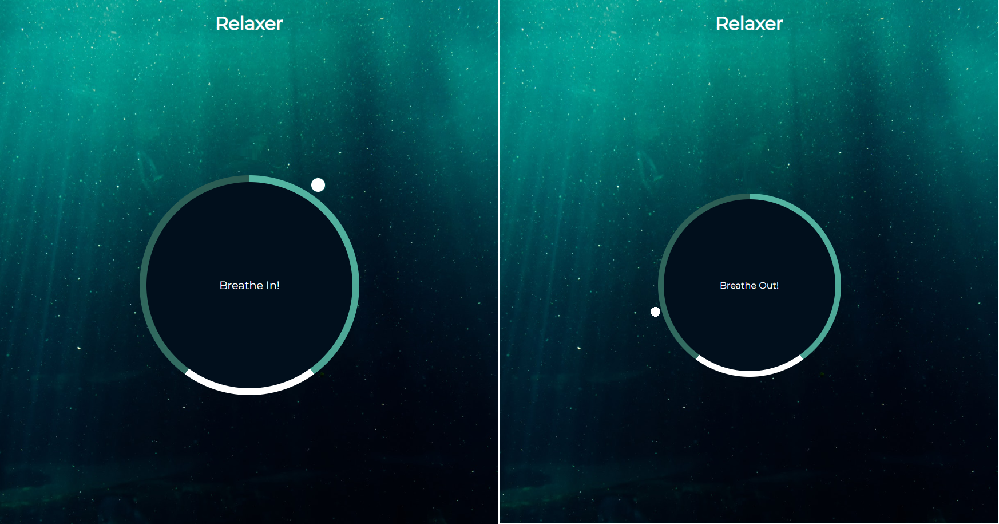
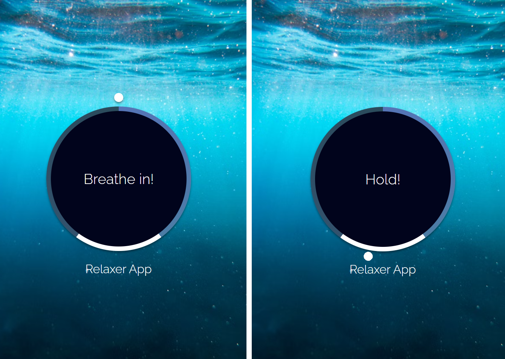

# Udemy--vanillawebprojects-16

**The sixteenth** in a series of **20 small projects** in **Vanilla JavaScript** from the [**Udemy course**](https://www.udemy.com/course/web-projects-with-vanilla-javascript/) by author [Brad Traversy](https://www.traversymedia.com/) with this [Brad's original GitHub repository](https://github.com/bradtraversy/vanillawebprojects).

# 16: Relaxer App

A relaxing breathing app with a visual director to tell you when to breathe in, hold and breathe out

## Project Specifications

- Create circle and gradient circle with CSS
- Create and animate pointer (Small circle)
- Create grow and shrink animations
- Add JavaScript to create the breath animation effect

## Original preview

    

## My solution preview

 

    

## My solution features

- custom UI/UX design
- the rest is same as an original

# Author

Website - [Petr Bednarski](https://github.com/pettik)  
Frontend Mentor - [@pettik](https://www.frontendmentor.io/profile/pettik)
